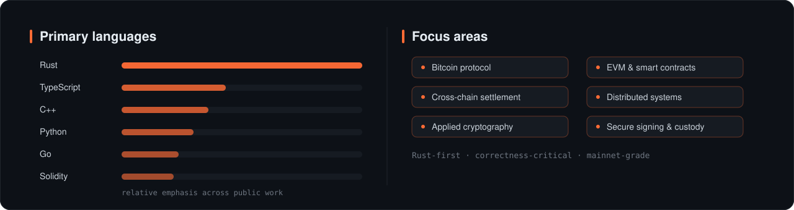

<!--
  Diwakar Matsa — GitHub profile README
  Theme: sleek minimal dark · accent #FF6B35 (ember) · bg #0D1117
  Banner is a hand-built animated SVG (assets/banner.svg), not a template.
-->

  

  
  
  
  

  

---

## About

I'm Diwakar — a **Blockchain & Backend Engineer** writing production **Rust** for Bitcoin, EVM, and multi-chain systems where correctness and security aren't optional.

I work across the cross-chain stack — **relayers, indexers, watchers / executors, and secure signing infrastructure**.

- 🦀 Rust-first, with Go, C++, TypeScript & Solidity in the toolbox
- ⛓️ Bitcoin Script, HTLCs, multisig cosigners, EVM & many chains (Solana, Dogecoin, Zcash, Starknet…)
- 🔐 Secure signing & custody — hardware-backed key management
- ☁️ AWS, Docker, CI/CD
- 📍 Hyderabad, India

---

## What I'm building now

**Crypto SDE 1 @ [Garden Finance](https://garden.finance) — a Bitcoin R&D studio.**

I build production Rust across Garden's cross-chain stack — **relayers, indexers, and secure signing infrastructure** powering **trust-minimized settlement** over Bitcoin, EVM, and many other chains. Lately: hardware-backed secure signing, high-throughput indexers, and **transaction fee & lifecycle infrastructure** — all mainnet-grade and security-critical.

> Specifics are under NDA — the open-source work below is the same caliber.

---

## Tech

  

---

## Featured open-source

| Project | What it is | Stack |
| --- | --- | --- |
| [**amm-rs**](https://github.com/21r21a33333/amm-rs) | Open, wei-exact AMM quoting library — Uniswap, Curve, Aerodrome, and your own pools | Rust |
| [**arb-router**](https://github.com/21r21a33333/arb-router) | On-chain arbitrage-detection router — venue-agnostic engine over a pool graph | Rust |
| [**blockchain**](https://github.com/21r21a33333/blockchain) | Uniform clients for interacting with many different blockchains | Go |
| [**btc-tee-escrow**](https://github.com/21r21a33333/btc-tee-escrow) | Trustless Bitcoin escrow inside a Trusted Execution Environment — TEE-compatible server, Bitcoin Script validation, provably-fair dispute resolution | Rust · Bitcoin |
| [**ts-plugins-**](https://github.com/21r21a33333/ts-plugins-) | Contract-first, high-performance plugin infrastructure | TypeScript |
| [**yt-notes**](https://github.com/21r21a33333/yt-notes) | Local pipeline turning any YouTube video into a structured note with frames, diagrams & timestamp links | Python |

**More** — [MuadibRouter](https://github.com/21r21a33333/MuadibRouter) · EVM routing & execution engine • [openfhe-secure-maxcosine](https://github.com/21r21a33333/openfhe-secure-maxcosine) · FHE encrypted-vector search • [choose-rich](https://github.com/21r21a33333/choose-rich) · multi-chain gaming API • [distributed-systems](https://github.com/21r21a33333/distributed-systems)

---

## Recent hackathon

### 🏆 uniPay — pay from any chain, settle & earn on Initia

A multi-chain merchant checkout: customers pay in **BTC, SOL, or USDC on any major EVM**, and merchants receive **USDC on Initia in ~30 seconds** through **trustless HTLC atomic swaps** — no bridges, no custodians. Idle merchant float can auto-stake into Initia DEX LP positions that earn swap fees *and* staking rewards at once via Enshrined Liquidity.

- ⚡ Sub-30-second settlement, demoed live across **4 ecosystems** — Bitcoin, Solana, EVM, Initia
- 🔗 HTLCs on Bitcoin / EVM / Solana / Initia + a custom Initia EVM rollup, per-chain watcher & executor services, and an orderbook / solver / staking backend
- 🧩 React + InterwovenKit frontend over the Initia Interwoven Bridge
- 🏅 DeFi track · built with a teammate

  <a href="https://dorahacks.io/buidl/43518"><b>Project</b></a> ·
  <a href="https://github.com/TARS-Finance/uniPay"><b>Code</b></a> ·
  <a href="https://www.youtube.com/watch?v=DHzId2D8UTQ"><b>Demo video</b></a> ·
  <a href="https://scan.testnet.initia.xyz/utars-chain-1"><b>Rollup explorer</b></a>

---

## Focus & activity

  

  

---

## Connect

  
  

<i>Correctness is a feature. Ship it like it's mainnet.</i>

